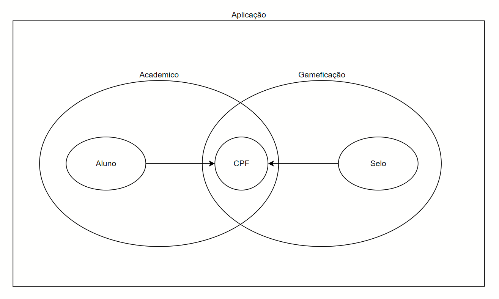

## Objetivo do projeto
 - Projeto implementado para estudo nos modelos estruturais: DDD, Clean Architecture e Hexagon Architecture. 
 - Visa um aprofundamento na área de Arquitetura de Software utilizando PHP.

## Mapa de Contexto:

